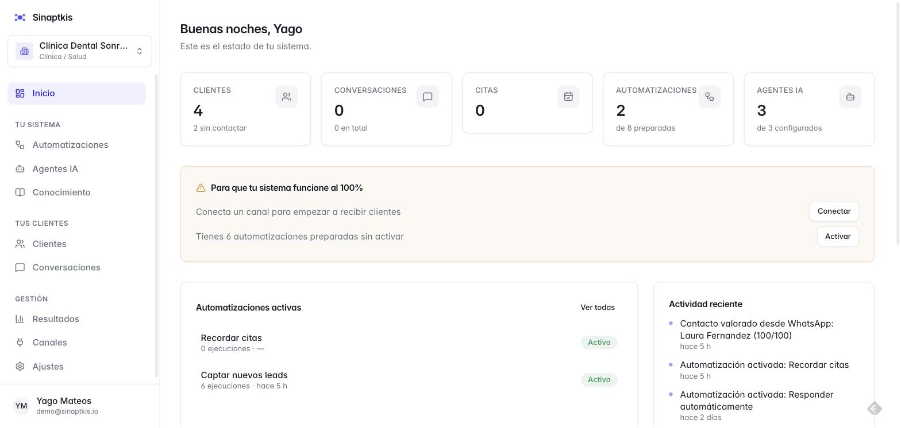
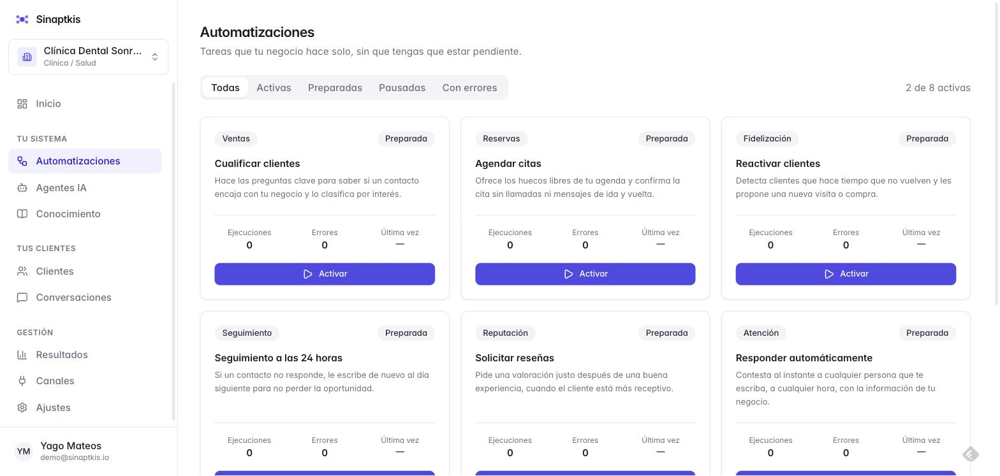
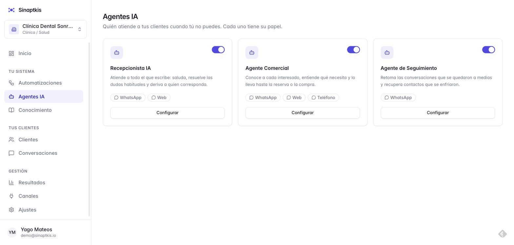
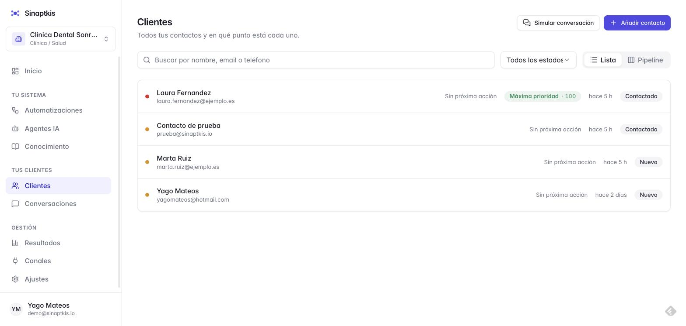
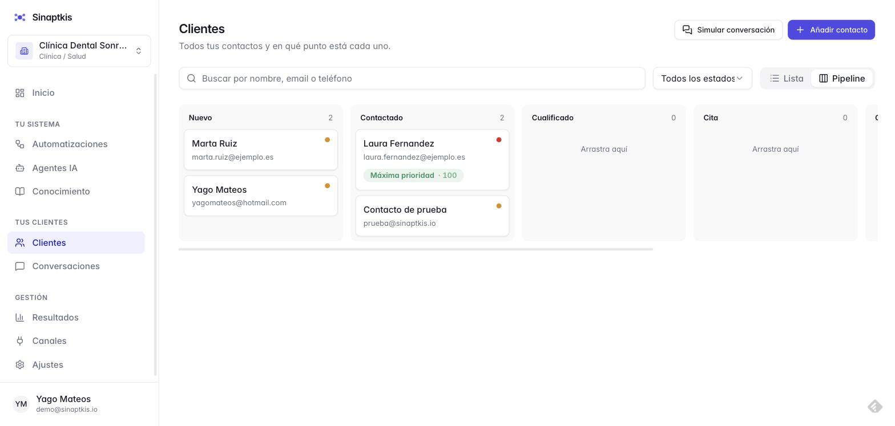
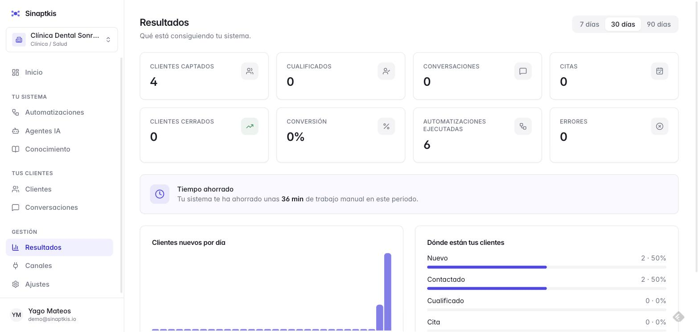
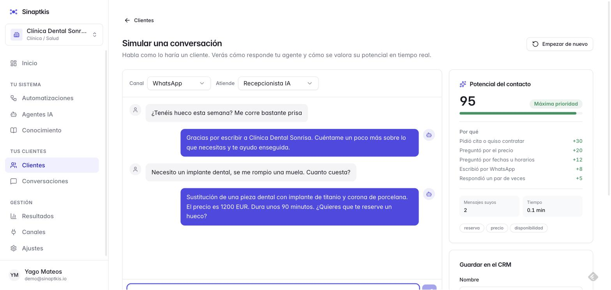

# Sinaptkis AI Business Builder

Un negocio entra con una descripción. Sale con un sistema digital funcionando:
automatizaciones que se ejecutan solas, agentes de IA configurados con sus
precios y condiciones, CRM y canales.

SaaS multiempresa sobre React + TypeScript + Vite + Supabase, con n8n como motor
de ejecución.

**En producción:** https://sinaptiks-ia-business-builder.vercel.app

---

## Capturas

| | |
|---|---|
|  **Dashboard** — estado del sistema, actividad reciente y alertas de lo que falta configurar. |  **Automatizaciones** — las que el generador propuso para este negocio, con su categoría y estado. |
|  **Agentes IA** — Recepcionista, Comercial y Seguimiento, cada uno con sus canales. |  **Clientes** — con el potencial calculado de cada conversación. |
|  **Pipeline** — arrastra un contacto entre etapas; la puntuación viaja con él. |  **Resultados** — leads, conversión, ejecuciones y tiempo ahorrado. |

**Simulador de conversación**, en `/app/clientes/simulador`: se habla como lo
haría un cliente, el agente responde con los precios reales del negocio, y el
potencial se recalcula mensaje a mensaje.



---

## El recorrido

```
Registro → Crear negocio → Onboarding (6 pasos) → Generación → Dashboard
```

El onboarding pregunta seis cosas: datos del negocio, qué hace, cliente ideal,
servicios con precios, objetivos y canales. Con eso el generador decide qué
automatizaciones, agentes, pipeline y conexiones necesita ese negocio concreto,
y los crea.

Una clínica dental que marca *captar clientes*, *Telegram* y *reservas* recibe 8
automatizaciones, 3 agentes (Recepcionista, Comercial, Seguimiento), pipeline
con etapa de cita, y Telegram + Calendar + Gmail. Un ecommerce con los mismos
objetivos recibe algo distinto.

---

## Puesta en marcha

### 1. Instalar

```bash
npm install
cp .env.example .env.local
```

### 2. Supabase

Crea un proyecto en [supabase.com](https://supabase.com) y rellena en
`.env.local`:

```
VITE_SUPABASE_URL=https://tu-proyecto.supabase.co
VITE_SUPABASE_ANON_KEY=sb_publishable_...
```

Ambas están en *Project Settings → API Keys*. La publishable es pública por
diseño: quien protege los datos es el RLS, no el secreto de la clave.

### 3. Base de datos

En el **SQL Editor** de tu proyecto, ejecuta en orden:

1. `supabase/migrations/20260101000000_init.sql`
2. `supabase/migrations/20260102000000_fix_business_insert_returning.sql`

Crea 18 tablas con sus índices, triggers y políticas RLS.

> Con la CLI: `supabase db push`

### 4. Arrancar

```bash
npm run dev
```

Sin las variables configuradas la app no falla en blanco: muestra una pantalla
explicando qué falta.

---

## Conectar el motor de automatización

Sin esto la app funciona igual, pero las automatizaciones no ejecutan nada real.

### 1. Levantar n8n

```bash
docker run -d --name n8n -p 5678:5678 \
  -v n8n_data:/home/node/.n8n \
  -e N8N_SECURE_COOKIE=false \
  docker.n8n.io/n8nio/n8n
```

Abre http://localhost:5678, crea la cuenta de propietario, y genera una API key
en *Settings → n8n API*.

### 2. Darle una URL pública

Las Edge Functions corren en la nube de Supabase y no alcanzan `localhost`:

```bash
ngrok http 5678
```

> El túnel gratuito **cambia de URL cada vez que se reinicia**. Para algo
> estable, n8n necesita un servidor con dominio fijo.

### 3. Guardar los secretos

```bash
supabase secrets set \
  N8N_API_URL="https://tu-tunel.ngrok-free.app" \
  N8N_API_KEY="tu-api-key" \
  N8N_CALLBACK_SECRET="$(openssl rand -hex 32)" \
  --project-ref tu-project-ref
```

Nunca en `.env.local`: todo lo prefijado con `VITE_` acaba en el JavaScript que
descarga cualquier visitante.

### 4. Desplegar las funciones

```bash
supabase functions deploy n8n --project-ref tu-project-ref
supabase functions deploy n8n-callback --project-ref tu-project-ref
```

### 5. Apuntar la app

```
VITE_API_BASE_URL=https://tu-proyecto.supabase.co/functions/v1
```

Ahora activar una automatización crea un workflow real en n8n.

---

## Cómo funciona la conexión con n8n

El usuario nunca ve n8n. Elige "Responder automáticamente" y por detrás:

```
Navegador                Edge Function            n8n
    │                         │                    │
    │── activar ─────────────▶│                    │
    │   (sesión Supabase)     │── crear workflow ─▶│
    │                         │   (API key)        │
    │◀──── workflow id ───────│                    │
    │                         │                    │
    │                    n8n-callback ◀── acción ──│
    │                         │   (secreto)        │
    │                    escribe en BD             │
```

**Dos direcciones, dos formas de autenticar.** La función `n8n` la llama una
persona con sesión iniciada, y comprueba que pertenece al negocio antes de
tocar nada. La función `n8n-callback` la llama el motor, que no tiene sesión:
se autentica con un secreto compartido.

La función lee la automatización de la base de datos en vez de fiarse del
cuerpo de la petición, para que el cliente no pueda inventarse acciones.

### Qué se ejecuta de verdad

| Acción | Estado |
|---|---|
| Crear contacto | ✅ real |
| Actualizar contacto | ✅ real |
| Avisar al equipo | ✅ real — notificación en la campana, enlazando a lo que la originó |
| Esperar X horas | ✅ real (lo hace n8n) |
| Agente responde | ✅ real — crea la conversación, consulta lo que subiste a Conocimiento, y responde con Claude si hay clave configurada |
| Puntuar potencial del contacto | ✅ real — en cada mensaje, no solo en el simulador; mueve `potential_score`/`potential_label` en el CRM |
| Derivar a una persona | ✅ real — por palabra clave, por turnos sin avanzar, o porque el propio agente lo decidió; marca la conversación, avisa por la campana y el agente deja de responder |
| Telegram (mensajes reales de clientes) | ✅ real, una vez conectado — ver abajo |
| WhatsApp (mensajes reales de clientes) | ✅ real, una vez conectado — ver abajo |
| Enviar email | ✅ real (Resend) con un contacto directo o como recordatorio/reactivación programado — "pendiente de canal" solo si no hay email o Resend no está configurado |
| Agendar cita | ✅ real (Google Calendar) con un contacto directo, fecha y calendario conectado — "pendiente de canal" en cualquier otro caso |

Estas últimas registran el paso sin enviar nada solo cuando de verdad falta
algo (el proveedor sin configurar, o un "programado" sin contacto resuelto):
es preferible dejar constancia a fingir un mensaje que nadie recibe.

### Canales de mensajería: Telegram y WhatsApp

**Telegram** está completamente conectado — solo falta el paso que le toca a
cada negocio:

1. En **Canales**, pulsa *Conectar* en la tarjeta de Telegram
2. Habla con [@BotFather](https://t.me/BotFather) en Telegram → `/newbot` →
   te da un token en segundos, sin coste ni verificación
3. Pega el token en el formulario

A partir de ahí: cada mensaje real a ese bot crea o continúa la conversación
del contacto, consulta lo que el negocio subió a Conocimiento, genera la
respuesta con el agente activo que corresponda y la envía de vuelta por
Telegram — el mismo camino, verificado, que ya usan las automatizaciones.

**WhatsApp** usa el mismo camino (WhatsApp Cloud API), pero con dos requisitos
que Telegram no tiene: un token de acceso con permiso sobre un número de
WhatsApp Business, y ese número verificado en Meta Business Suite — un
trámite que solo puede abrir el propio negocio, no algo que resuelva el
código. Con ese número, la tarjeta de WhatsApp en **Canales** pide el ID del
número y el token de acceso, los valida contra la Graph API antes de guardar
nada, y a partir de ahí funciona igual que Telegram. Además, a nivel de
plataforma hacen falta `WHATSAPP_VERIFY_TOKEN` y `WHATSAPP_APP_SECRET`
(secrets de la Edge Function `whatsapp-webhook`) para que el webhook
compartido acepte mensajes de cualquier negocio conectado.

Las credenciales de ambos canales nunca se vuelven a leer después de
guardarse: `channel_credentials` es una tabla sin política de lectura para
nadie sujeto a RLS, solo escritura; únicamente la Edge Function del webhook
correspondiente (con la service role) puede recuperarlas, y solo a través de
una función de base de datos dedicada y bloqueada al resto de roles.

---

## Arquitectura

Cuatro capas con dirección de dependencia estricta:

```
UI (React)  →  Application Services  →  Supabase  →  External Services
```

```
src/
├── domain/                    Lógica pura. Sin React, sin I/O.
│   ├── types.ts               El modelo de datos completo
│   ├── vocabulary.ts          Etiquetas visibles (la UI nunca muestra un enum)
│   ├── catalog/               Los datos que definen el producto
│   │   ├── automation-blueprints.ts
│   │   ├── agent-blueprints.ts
│   │   └── industry-templates.ts   10 sectores
│   └── engine/
│       ├── recommendation-engine.ts     Puntúa el catálogo
│       ├── agent-generator.ts           Perfil → system prompt
│       └── business-system-generator.ts Orquestador
│
├── services/                  Acceso a datos y sistemas externos
│   ├── supabase/              Cliente y traducción de errores
│   ├── repositories/          Un repositorio por agregado
│   ├── system/                Provisioning y ciclo de vida
│   ├── n8n/                   Contrato + implementación real y simulada
│   ├── ai/                    Contrato + proveedores intercambiables
│   └── vector/                Chunking para la base de conocimiento
│
├── features/                  Una carpeta por área del producto
├── components/                Primitivas de UI y layout
└── app/                       Router y guardas

supabase/
├── migrations/                     Esquema y RLS
└── functions/                      Edge Functions (Deno)
    ├── n8n/                        App → motor (crea/actualiza workflows, dispara ejecuciones)
    ├── n8n-callback/               Motor → app (resultado de cada acción, sin sesión)
    ├── automation-dispatch/        Dispara automatizaciones por evento, sin duplicados
    ├── automation-scheduled-jobs-run/  Cron: delay real entre pasos, con reintentos
    ├── automation-inactivity-scan/     Cron: dispara el disparador "inactividad"
    ├── channels/                   Conectar/desconectar Telegram y WhatsApp
    ├── telegram-webhook/           Mensajes entrantes de Telegram
    ├── whatsapp-webhook/           Mensajes entrantes de WhatsApp
    ├── google-calendar-oauth/      OAuth y creación de citas reales
    ├── stripe/ · stripe-webhook/   Checkout/portal y estado de suscripción real
    ├── knowledge/                  Ingesta y búsqueda (semántica o por palabra clave)
    ├── ai/                         Respuesta del agente (Claude/OpenAI/Ollama/reglas)
    ├── fetch-url/                  Lee páginas web para Conocimiento
    └── _shared/                    Auth, clientes externos, traductor de workflows
```

### Por qué así

**El dominio no sabe que existe React ni Supabase.** `generateBusinessSystem()`
es una función pura: mismo perfil, mismo sistema. Se puede probar sin navegador
ni base de datos.

**El catálogo es datos, no código.** Añadir una automatización al producto es
añadir una entrada en `automation-blueprints.ts`. Añadir un sector, una entrada
en `industry-templates.ts`. Ni la UI ni el motor cambian.

**Los servicios externos se declararon antes de existir.** `N8nService` y
`AiService` son interfaces con implementación simulada. Conectar n8n de verdad
no obligó a cambiar ni un componente.

---

## Multi-tenant

Un usuario puede tener varios negocios. Cada fila lleva `business_id` y el
aislamiento lo impone Postgres, no el frontend.

Las políticas RLS usan funciones `SECURITY DEFINER` (`is_business_member`,
`has_business_role`, `is_super_admin`) para evitar recursión entre políticas.
Consultar datos de otro negocio no da error: devuelve cero filas.

Roles: `owner`, `admin`, `member`. A nivel de plataforma, `super_admin`
habilita `/admin`:

```sql
update profiles set platform_role = 'super_admin' where email = 'tu@email.com';
```

---

## Seguridad

- **Ningún secreto en el frontend.** Todo lo prefijado con `VITE_` acaba en el
  bundle. Las credenciales de n8n y los modelos viven en Edge Functions.
- **RLS activo en las 18 tablas**, verificado: lectura anónima devuelve `[]` y
  la escritura se rechaza con `42501`.
- **Rutas protegidas** por sesión, por negocio con onboarding completo y por rol.
- **Errores traducidos** a mensajes que una persona no técnica entiende.
- Estados de carga, vacío y error en cada pantalla.

### Antes de tener usuarios reales

1. Activa **Confirm email** en *Authentication → Providers → Email*. Sin eso
   cualquiera crea cuentas ilimitadas con correos inventados.
2. Revisa que ninguna secret key haya acabado en un repo o un chat.

---

## Desplegar

El frontend está en Vercel. `vercel.json` reescribe todas las rutas a
`index.html` — sin eso, recargar en cualquier ruta que no sea la raíz da 404.

```bash
vercel deploy --prod
```

Variables necesarias en Vercel: `VITE_SUPABASE_URL`, `VITE_SUPABASE_ANON_KEY` y
`VITE_API_BASE_URL`.

---

## Comandos

```bash
npm run dev       # servidor de desarrollo
npm run build     # typecheck + build de producción
npm run preview   # servir el build
npm run lint      # eslint
```

---

## Estado

**Funcionando:** autenticación, multi-tenancy con RLS, onboarding, perfil de
negocio, generador de sistemas, dashboard, automatizaciones conectadas a n8n
real (con rastro explicado paso a paso cuando fallan a mitad de camino, delay
real entre pasos y resincronización que nunca se marca correcta si n8n
falla), clasificador de intención (heurístico + Claude), agentes IA con
editor de instrucciones, base de conocimiento con chunking (texto, preguntas
frecuentes, archivo .txt y páginas web leídas de verdad, con vista de los
fragmentos procesados), CRM con lista y kanban, puntuación de potencial en
cada conversación real, derivación automática a una persona, campana de
avisos, bandeja de conversaciones, marketplace de conexiones (Telegram y
WhatsApp conectables de verdad, Google Calendar con OAuth real y citas
creadas en el calendario), email real vía Resend (directo y en campañas
programadas de recordatorio/reactivación), facturación con Stripe
(checkout, portal y webhooks) cuando hay credenciales, analíticas y panel de
administración.

**Pendiente por credenciales o trámite externo, con estado honesto mientras
tanto:** llamadas a modelos de IA sin clave configurada (motor de reglas
determinista de respaldo), búsqueda semántica sin Qdrant/OpenAI configurados
(cae a palabra clave sobre Postgres), Stripe sin sus claves/Price ID, y
WhatsApp sin el número de empresa verificado en Meta (y sin
`WHATSAPP_VERIFY_TOKEN`/`WHATSAPP_APP_SECRET` de plataforma).
